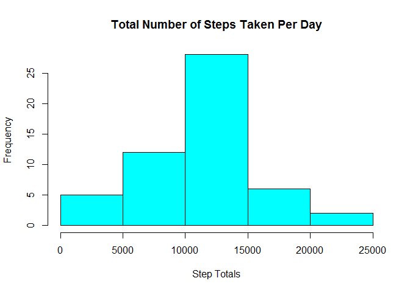
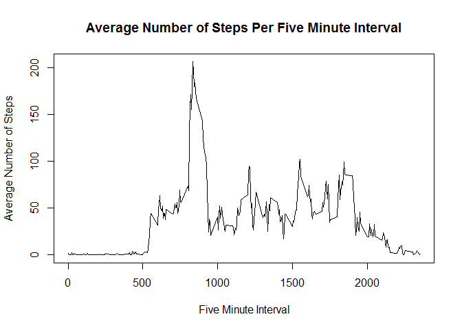
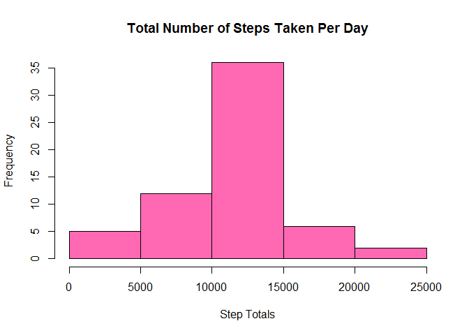
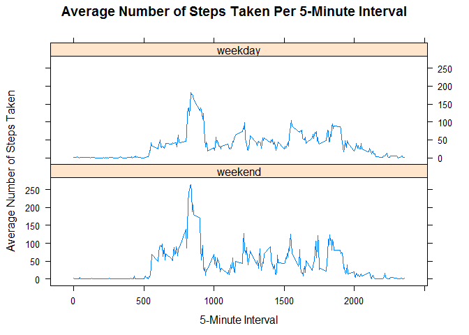

# Reproducible Research: Peer Assessment 1
SLaw7  


## Loading and preprocessing the data

Read the data. 

```r
data <- read.csv( "Activity/activity.csv" )
```


## What is mean total number of steps taken per day?

Calculate the total number of steps taken per day.

```r
day_steps <- aggregate( steps ~ date, data = data, sum )
```

Make a histogram of the total number of steps taken each day.

```r
hist( day_steps$steps, 
      col = "cyan", 
      main = "Total Number of Steps Taken Per Day", 
      xlab = "Step Totals" )
```

 

Calculate and report the **mean** and **median** total number of steps taken per day.

```r
mean( day_steps$steps )
```

```
## [1] 10766.19
```

```r
median( day_steps$steps )
```

```
## [1] 10765
```


## What is the average daily activity pattern?

Compute the average number of steps taken across all days, for each five minute interval.

```r
avg_steps <- aggregate( steps ~ interval, data = data, mean )
```

Make a time series plot of the 5-minute interval and the average number of steps taken

```r
plot( avg_steps$steps ~ avg_steps$interval, 
      type = "l", 
      main = "Average Number of Steps Per Five Minute Interval", 
      xlab = "Five Minute Interval", 
      ylab = "Average Number of Steps" )
```

 


*Which 5-minute interval, on average across all the days in the dataset, contains the maximum number of steps?*

First, we will find the interval where there is the largest number of average steps.

```r
avg_steps[ avg_steps$steps == max(avg_steps$steps), ]
```

```
##     interval    steps
## 104      835 206.1698
```

Thus, on average, there are the most steps in the interval from 8:35am to 8:40am.


## Imputing missing values

Calculate and report the total number of missing values in the dataset.

```r
sum( is.na( data ) )
```

```
## [1] 2304
```

Create a new dataset by filling in all of the missing values in the dataset with the mean for that 5-minute interval.

```r
complete_data <-data
for ( i in 1:length( complete_data$steps ) ) {
     if( is.na( complete_data$steps[i] ) == TRUE ) {
         x <- complete_data$interval[i]
         complete_data$steps[i] <- avg_steps[ avg_steps$interval == x, 2]
     }
}
```

Calculate the total number of steps taken per day using the new dataset.

```r
day_steps2 <- aggregate( steps ~ date, 
                         data = complete_data, 
                         sum )
```

Make a histogram of the total number of steps taken each day using the new dataset.

```r
hist( day_steps2$steps, 
      col = "hotpink", 
      main = "Total Number of Steps Taken Per Day", 
      xlab = "Step Totals" )
```

 

Calculate and report the **mean** and **median** total number of steps taken per day, using the new datset.

```r
mean( day_steps2$steps )
```

```
## [1] 10766.19
```

```r
median( day_steps2$steps )
```

```
## [1] 10766.19
```

*Do these values differ from the estimates from the first part of the assignment?*

Yes and no. We can see from the histogram there are more days with a higher number of step totals. The mean stayed the same, and the median increased by a little more than one step.

*What is the impact of imputing missing data on the estimates of the total daily number of steps?*

The impact is either nutral or an increased step count for each day. Since the "NA" entries were ignored in the original sumations, it's as though they were treated as zero. Whatever the "NA's" were replaced by in the complete_data set is greater than or equal to zero, thus a weakly positive effect is produced on the total daly step count.


## Are there differences in activity patterns between weekdays and weekends?

Notice that up until now, the "date" column of the datasets has been a factor. I will now format the date variable as POSIXlt.

```r
complete_data$date <- strptime( complete_data$date, "%Y-%m-%d" )
```

Create a new factor variable in the dataset with two levels - "weekday" and "weekend" indicating whether a given date is a weekday or weekend day.

```r
#create a column with the day of the week for each entry
complete_data <- cbind( complete_data, "day" = weekdays( complete_data$date ) )
#relabel the "Sunday" and "Saturday" levels "weekend", and the other five levels "weekday"
levels( complete_data$day ) <- c( "weekend", "weekday", "weekday", "weekday", "weekday", "weekday", "weekend" )
```

Compute the average number of steps taken on **weekends**, for each five minute interval.

```r
avg_weekend_steps <- aggregate( steps ~ interval, 
                                data = complete_data[ complete_data$day == "weekend", ], 
                                mean )
```

Compute the average number of steps taken on **weekdays**, for each five minute interval.

```r
avg_weekday_steps <- aggregate( steps ~ interval, 
                                data = complete_data[ complete_data$day == "weekday", ], 
                                mean )
```

Create a dataset of the above information.

```r
avg_weekend_steps$day <- as.factor( "weekend" )
avg_weekday_steps$day <- as.factor( "weekday" )
avg_day_steps <- rbind( avg_weekend_steps, avg_weekday_steps )
```
Make a time series plot of the 5-minute interval and the average number of steps taken, averaged across all weekday days or weekend days. 

```r
library( lattice )
xyplot( steps ~ interval | day, 
        data = avg_day_steps, 
        type = "l",
        layout = c(1, 2), 
        main = "Average Number of Steps Taken Per 5-Minute Interval",
        xlab = "5-Minute Interval", 
        ylab = "Average Number of Steps Taken" )
```

 
